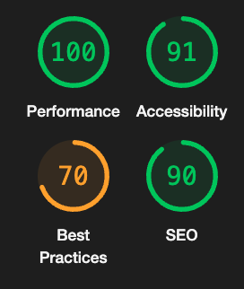
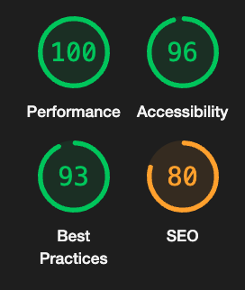
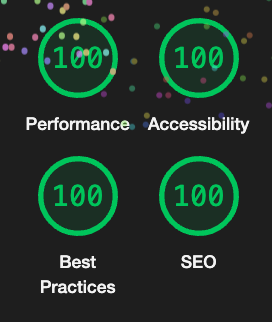
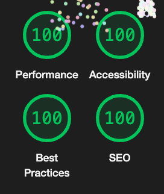

[](https://nodejs.org/)
[](https://vitejs.dev/)
[](https://bun.sh/)
[](https://www.typescriptlang.org/)
[](https://eslint.org/)
[](https://prettier.io/)
[](https://reactjs.org/)
[](https://reactrouter.com/)
[](https://redux-toolkit.js.org/)
[](https://tailwindcss.com/)
[](https://github.com/sriver/date-picker-react-v2)

# HRnet - Application de gestion des employés
Ce projet est une application de gestion des employés pour WealthHealth. 

L'objectif principal était de mettre à jour HRnet depuis un projet JQuery et le convertir en React.


## Sommaire

1. [Fonctionnalités principales](#fonctionnalités-principales)
2. [Démo](#démo)
3. [Rapport de performance](#rapport-de-performance)
4. [Prérequis](#prérequis)
5. [Installation](#installation)
6. [Utilisation](#utilisation)
7. [Exemple du date picker](#exemple-du-date-picker)
8. [Auteur](#auteur)
9. [Licence](#licence)

## Fonctionnalités principales

- ✅ Conversion complète du projet en React
- ✅ Ajout d'un système de gestion d'état avec Redux Toolkit
- ✅ Création d'un plugin React pour le sélecteur de date 
- ✅ Interface utilisateur responsive avec Tailwind CSS

## Démo

- Vercel : [Lien](https://r-hnet-react-1otu47sr8-dsrivers-projects.vercel.app)

## Rapport de performance

- audit au format Json de Lighthouse pour la page de création d'employés: [Lien](./public/localhost-index-v2.json)
- audit au format Json de Lighthouse pour la page de tableau d'employés: [Lien](./public/localhost-list-v2.json)

### Rapport de performance V1 (Jquery)

 


### Rapport de performance V2 (React)




## Prérequis

Pour obtenir et construire le projet, vous aurez besoin d'installer :

- NodeJS
- Git
- Un terminal pour exécuter les commandes.

## Installation

```sh
git clone https://github.com/D-Sriver/RHnet-react.git
cd RHnet-react
npm install
```

## Utilisation

```sh
npm run dev
```

## Exemple du date picker


## Auteur

[D-Sriver](https://github.com/D-Sriver)

## Licence

[MIT](https://github.com/D-Sriver/RHnet-react/blob/main/LICENSE)
